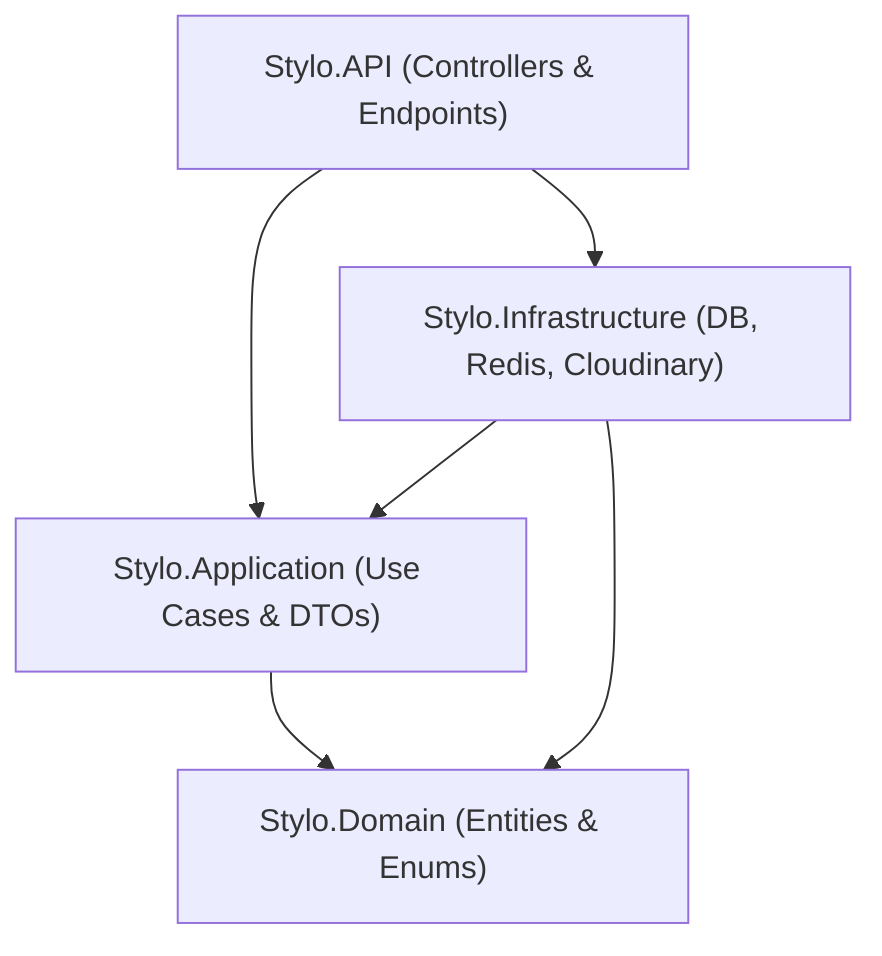

# 🛍️ Stylo Backend - E-Commerce API Service

<div align="center">
  
[](https://dotnet.microsoft.com/)
[](https://blog.cleancoder.com/uncle-bob/2012/08/13/the-clean-architecture.html)
[](https://www.microsoft.com/sql-server)
[](https://redis.io/)
[](https://jwt.io/)
[](https://cloudinary.com/)
[](http://localhost:5000/swagger)
</div>

**Stylo Backend** is a high-performance, scalable RESTful Web API service for the **Stylo** clothing and fashion e-commerce platform. Built with **.NET 10** and structured following **Clean Architecture** principles, it provides robust domain logic isolation, seamless API integrations, and complete maintainability.

---

## 📑 Table of Contents

1. [✨ Key Features](#-key-features)
2. [🏗️ Clean Architecture](#️-clean-architecture)
3. [🛠️ Tech Stack & Dependencies](#️-tech-stack--dependencies)
4. [🚀 Prerequisites](#-prerequisites)
5. [⚙️ Environment Setup & Configuration](#️-environment-setup--configuration)
6. [📧 Customer Email Requirement (Real Gmail)](#-customer-email-requirement-real-gmail)
7. [🏁 How to Installation & Run](#-how-to-installation--run)
8. [🔑 Default Test Credentials](#-default-test-credentials)
9. [📡 API Endpoints Summary](#-api-endpoints-summary)
10. [🗄️ Database Migrations](#️-database-migrations)
11. [📂 Project Directory Structure](#-project-directory-structure)
12. [👥 Team Members & Contributors](#-team-members--contributors)

---

## ✨ Key Features

### 🔐 Authentication & Security
- **ASP.NET Core Identity**: Full user and role management (`Admin`, `Customer`).
- **JWT (JSON Web Tokens)**: Secure token-based authentication with active token revocation checks (`TokenManagerService`).
- **OTP & Password Reset**: Secure One-Time Password generation, hashing, and verification via SMTP email delivery.

### 👕 Product & Catalog Management
- **Advanced Filtering**: Filter products by Category, Gender (`Men`, `Women`, `Kids`), Size (`S`, `M`, `L`, `XL`, `XXL`), and Price Range.
- **Pagination & Search**: Efficient data retrieval with keyword searching and paginated responses.
- **Cloud Image Storage**: Integration with **Cloudinary API** for uploading product media and user profile photos.

### 🛒 Shopping Cart & Order Processing
- **Dynamic Cart**: Per-user cart state management with real-time total computation.
- **Order Lifecycle**: Complete order creation (checkout) and status tracking (`Pending`, `Processing`, `Shipped`, `Delivered`, `Cancelled`).

### ❤️ Wishlist & Feedback Systems
- **Favorites (Wishlist)**: Personal product saved items per customer.
- **Product Reviews & Ratings**: Customer reviews, star ratings, and feedback moderation.
- **Website Feedback**: Portal for collecting user store feedback and suggestions.

### 📊 Admin Control Center
- **Dashboard Analytics**: Revenue tracking, total order metrics, active user count, and top-selling products.
- **Order Management**: Admin portal for modifying order statuses and fulfilling customer orders.

### ⚡ Performance & Reliability
- **Distributed Caching (Redis)**: Speeding up query responses and managing OTP expiration windows.
- **Global Error Handling**: Custom exception middleware returning standardized API error models.

---

## 🏗️ Clean Architecture

The solution adheres strictly to **Clean Architecture** principles, dividing responsibility into 4 decoupled layers:



- **`Stylo.Domain`**: Core business models (`User`, `Product`, `Order`, `Cart`, `Category`, `Favorite`) and domain enums (`OrderStatus`, `UserRole`, `Gender`, `Size`), independent of external dependencies.
- **`Stylo.Application`**: Use cases, business logic services, contracts/interfaces, custom exceptions, and Data Transfer Objects (DTOs).
- **`Stylo.Infrastructure`**: Persistence layer containing `AppDbContext`, repository implementations, SMTP email service, Redis cache service, Cloudinary uploader, and initial database seeder (`DbSeeder`).
- **`Stylo.API`**: HTTP entry points, Controllers, Middleware, Dependency Injection registrations, CORS policies, and OpenAPI/Swagger documentation.

---

## 🛠️ Tech Stack & Dependencies

| Component | Technology / Library |
| :--- | :--- |
| **Framework** | .NET 10.0 (ASP.NET Core Web API) |
| **ORM** | Entity Framework Core 10.0 |
| **Database** | Microsoft SQL Server (`StyloDB`) |
| **Caching** | Redis (`StackExchange.Redis`) |
| **Auth & Security** | ASP.NET Core Identity & JWT Bearer Token |
| **Media Storage** | Cloudinary (`CloudinaryDotNet`) |
| **Email Service** | SMTP / MailKit (for OTP & Notifications) |
| **API Documentation** | Swashbuckle (Swagger UI v1) |

---

## 🚀 Prerequisites

Ensure the following tools are installed on your machine before running the application:

1. **[.NET 10.0 SDK](https://dotnet.microsoft.com/download/dotnet/10.0)** or higher.
2. **[Microsoft SQL Server](https://www.microsoft.com/en-us/sql-server/sql-server-downloads)** (SQL Express, LocalDB, or full instance).
3. **[Redis Server](https://redis.io/download)** (Optional for local caching testing; can be run locally or via Docker).
4. **Git** version control system.

---

## ⚙️ Environment Setup & Configuration

Configure your application settings inside `Stylo.API/appsettings.json` or `appsettings.Development.json`:

```json
{
  "ConnectionStrings": {
    "DefaultConnection": "Server=.\\SQLEXPRESS;Database=StyloDB;Trusted_Connection=True;TrustServerCertificate=True;"
  },
  "Jwt": {
    "SecretKey": "SuperSecretKeyForStyloBackendECommerceApp2026!",
    "Issuer": "StyloAPI",
    "Audience": "StyloClient",
    "ExpirationInMinutes": 60
  },
  "Redis": {
    "ConnectionString": "localhost:6379",
    "InstanceName": "Stylo:"
  },
  "Otp": {
    "Length": 6,
    "ExpirationMinutes": 5,
    "MaxAttempts": 5,
    "ResendCooldownSeconds": 60,
    "ResetTokenExpirationMinutes": 10,
    "HashingSecret": "YourOtpHashingSecretKey"
  },
  "Email": {
    "SmtpHost": "smtp.gmail.com",
    "SmtpPort": 465,
    "SmtpUser": "your-smtp-email@gmail.com",
    "SmtpPassword": "your-gmail-app-password",
    "FromEmail": "noreply@stylo.com",
    "FromName": "Stylo Store",
    "UseSsl": true
  },
  "CloudinarySettings": {
    "CloudName": "your_cloud_name",
    "ApiKey": "your_api_key",
    "ApiSecret": "your_api_secret"
  }
}
```

---

## 📧 Customer Email Requirement (Real Gmail)

> [!IMPORTANT]
> **Requirement for Customer Email Accounts:**
> Any **Customer** registered in the system or used during testing MUST use a **valid real Gmail address (`@gmail.com`)**.
> 
> **Why?**
> The backend relies on SMTP email delivery to send **OTP (One-Time Password)** verification codes for password resets, email verifications, and account notifications. If an invalid or fictional email address is provided, OTP code delivery will fail and verification features cannot be completed.

---

## 🏁 How to Installation & Run

### 1️⃣ Clone the Repository
```bash
git clone https://github.com/your-username/Stylo.Backend.git
cd Stylo.Backend
```

### 2️⃣ Restore NuGet Packages
```bash
dotnet restore
```

### 3️⃣ Apply Database Migrations & Initial Seed
> 💡 **Note:** Database migrations and default data seeding (`DbSeeder.cs`) execute **automatically** on application startup in `Program.cs`. 
>
> If you prefer to update the database manually, run:
```bash
dotnet ef database update --project Stylo.Infrastructure --startup-project Stylo.API
```

### 4️⃣ Build and Run the Application
```bash
dotnet build
dotnet run --project Stylo.API
```
Or simply run from the repository root:
```bash
dotnet run
```

### 5️⃣ Access Interactive API Documentation (Swagger)
Open your browser and navigate to:
👉 **`http://localhost:5000/swagger`** or **`https://localhost:5001/swagger`**

You can use the **Authorize** button in Swagger to input your JWT Token (`Bearer {your_token}`) and test protected endpoints.

---

## 🔑 Default Test Credentials

Upon first startup, default test accounts are seeded into the database:

| Account Role | Email Address | Password | Usage Note |
| :--- | :--- | :--- | :--- |
| **System Admin** | `admin@stylo.com` | `Admin123!` | System administration & dashboard access |
| **Test Customer 1** | `customer1@stylo.com` | `Customer123!` | Seeding placeholder customer |
| **New Customer Registration** | *(Your real `@gmail.com`)* | *(Your Password)* | **Must be a real Gmail account to receive OTP emails** |

---

## 📡 API Endpoints Summary

### 🔐 Auth & Identity (`/api/auth`)
- `POST /api/auth/register` - Register a new customer (requires real `@gmail.com`)
- `POST /api/auth/login` - Authenticate and receive a JWT Token
- `POST /api/auth/logout` - Revoke current JWT token
- `POST /api/auth/forgot-password` - Request a 6-digit OTP sent to user Gmail
- `POST /api/auth/verify-otp` - Validate OTP code
- `POST /api/auth/reset-password` - Reset password using verified OTP token

### 🛍️ Products & Categories (`/api/products` & `/api/categories`)
- `GET /api/products` - List all products (supports search, category/size/gender filtering, pagination)
- `GET /api/products/{id}` - Get product details by ID
- `POST /api/products` - Create new product with image upload (Admin only)
- `PUT /api/products/{id}` - Update product information (Admin only)
- `DELETE /api/products/{id}` - Remove a product (Admin only)
- `GET /api/categories` - Fetch all categories

### 🛒 Shopping Cart & Orders (`/api/cart` & `/api/orders`)
- `GET /api/cart` - View user's current shopping cart
- `POST /api/cart/items` - Add product item to cart
- `DELETE /api/cart/items/{id}` - Remove item from cart
- `POST /api/orders` - Checkout & place a new order
- `GET /api/orders` - View current customer's order history

### 📊 Admin Operations (`/api/admindashboard` & `/api/adminorders`)
- `GET /api/admindashboard/stats` - Overview of total sales, total revenue, order metrics & top products
- `GET /api/adminorders` - Fetch all orders across all customers
- `PUT /api/adminorders/{id}/status` - Update order delivery/fulfillment status

### ❤️ Favorites & Feedback (`/api/favourite`, `/api/productfeedback`, `/api/websitefeedback`)
- `GET /api/favourite` - List saved favorite items
- `POST /api/favourite/{productId}` - Toggle item in wishlist
- `POST /api/productfeedback` - Submit product review and rating
- `POST /api/websitefeedback` - Submit general website feedback

---

## 🗄️ Database Migrations

To create a new EF Core migration after modifying domain entities:
```bash
dotnet ef migrations add <MigrationName> --project Stylo.Infrastructure --startup-project Stylo.API
```

To update the SQL Server database:
```bash
dotnet ef database update --project Stylo.Infrastructure --startup-project Stylo.API
```

---

## 📂 Project Directory Structure

```text
Stylo.Backend/
├── Stylo.API/                  # Presentation Layer (Controllers, Middleware, Swagger)
│   ├── Controllers/            # REST API Endpoints
│   ├── Extensions/             # Dependency Injection & Auth setup
│   ├── Middleware/             # Global exception handling middleware
│   └── appsettings.json        # Configuration file
├── Stylo.Application/          # Application Layer (Interfaces, DTOs, Services)
│   ├── DTOs/                   # Data Transfer Objects
│   ├── Interfaces/             # Business & Repository Contracts
│   └── Services/               # Business Logic Implementations
├── Stylo.Domain/               # Domain Layer (Core Entities & Enums)
│   ├── Entities/               # Product, User, Order, Cart, Category...
│   └── Enums/                  # OrderStatus, UserRole, Gender, Size...
├── Stylo.Infrastructure/        # Infrastructure Layer (Data & External Integrations)
│   ├── Data/                   # AppDbContext & DbSeeder
│   ├── Repositories/           # Entity Framework Core Repositories
│   └── Services/               # Redis, Cloudinary & SMTP Email Services
├── Migrations/                 # EF Core DB Migration Files
└── README.md                   # Project Documentation
```

---

## 👥 Team Members & Contributors

| Member | Role | GitHub Profile |
| :--- | :--- | :--- |
| **Mostafa Mahmoud** | Backend Developer / Team Lead | [@Mostafa2115](https://github.com/Mostafa2115) |
| **Ahmed El-Mallah** | Backend Developer | [@AhmedElmalla7](https://github.com/AhmedElmalla7) |
| **Mohamed Abdelrahman** | Backend Developer | [@MohamedAttia2005](https://github.com/MohamedAttia2005) |


---

## 📜 License & Support

This repository is developed for the **Stylo** E-Commerce platform. All rights reserved © 2026.
